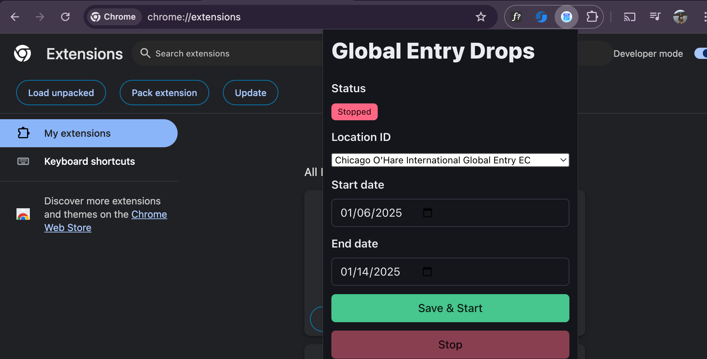
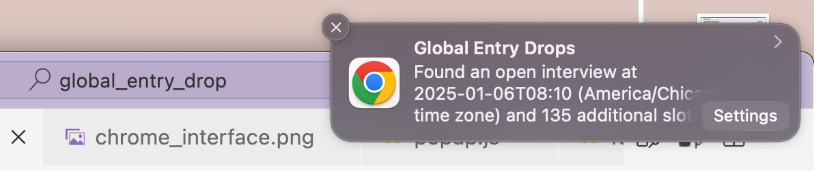

# Chrome extension: Global Entry Drops
This Chrome extension will find open slots for interview with U.S Custom and Border Protection given the location and timestamps given by the user. I built this project to learn to develop a Chrome extension.

### Chrome extension demo:

The extension interface:

The pop-up notifications:

### Issues I encountered duing development that will cause Service worker collapse while fetching:
    1. Import modules from files have to include`.js`
    2. Fail to add permissions for Chrome services
    
*Cre: I built this extension following a Youtube tutotrial made by * *JerryHacks*
